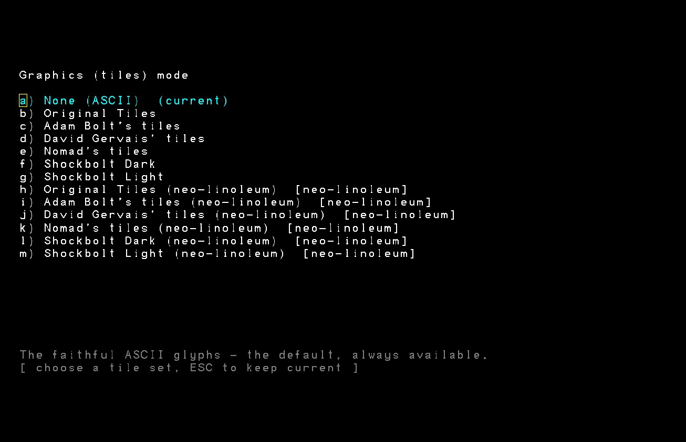

# Linoleum

A second tile engine for [Neo Angband](https://github.com/neostryder/neo-angband),
and the loose-pack tile format it draws.

**This is a mod.** It is not part of the game, it is off until you enable it, and
disabling it leaves the game's own graphics untouched.

## What it is not

Neo Angband already ships the five tile sets Angband itself distributes: Original,
Adam Bolt, David Gervais, Nomad and Shockbolt, the last catalogued as two modes, Dark
and Light. Those are **core content**: all six rows appear in the Graphics screen with
no mod enabled, drawn by the classic tilesheet engine, exactly as upstream. Nothing
here is needed to see them, and nothing here replaces them.

## What it adds

A different way to store a tile set, and an engine that draws it.



Enabling the mod adds six rows to the Graphics screen, one per source tileset, each
tagged `[linoleum]` and drawn by this mod's own engine rather than the classic
one - visible proof that the two engines coexist rather than one replacing the other.

A conventional tileset is one big image plus pixel coordinates: to change the orc you
open a 4096-pixel-wide PNG, find the orc, and edit in place. A **loose pack** is a
directory of individual images addressed by readable names:

```
my-pack/
  manifest.txt              pack id, format, resolution, which maps to read
  maps/
    targets.txt             feat / trap / monster / object / flavour, by name
    families.txt            shared effect metadata (only when authored)
    pools.txt               variant pools (only when authored)
    tall.txt                double-height tiles (only when the set has any)
  images/8/                 one PNG per tile, named for what it draws
    feat_granite_lit_0.png
    monster_cave_orc_0.png
  graf-*.prf, xtra-*.prf,   the source tileset's own pref files, mirrored
  flvr-*.prf                (present in a converted pack, optional in yours)
```

The `images/` subdirectory is the tile resolution in pixels: `images/8/` for an 8x8
set, `images/32/` for a 32x32 one, and it matches the `resolution:` line in
`manifest.txt`. A target map entry then names an image by base name with no path or
extension:

```
target:feat:GRANITE:asset:feat_granite_lit_0
```

You edit one file at a time, and the map says what it is for in words.

It also does two things a fixed sheet cannot:

- **Variant pools.** One symbol, creature or item can draw from several tiles instead
  of always the same one. Which tile a given square gets is chosen by map position, so
  it is identical on every replay of a seed: variety without breaking determinism.
- **Families.** Shared effect metadata across a group of tiles, declared once.
- **Double-height tiles, declared by name.** A tile listed in `maps/tall.txt` is two
  cells tall and is drawn over the cell above the one it stands in, which is how Shockbolt
  draws its larger monsters. A conventional sheet can only do this by reserving a
  band of rows in the image and telling the game which rows those are; here any tile
  can be tall, in a set with no sheet behind it at all.
- **A tile for a creature the pack has never heard of.** A mod's own monsters and
  items get a picture under these packs even though no pack was built with them in
  mind, and a picture of their own rather than a duplicate of a relative's. This
  mod supplies that; the game does not. See below.
- **A picture for a shapechanged character.** A Druid in bear form is drawn as a
  bear rather than as the usual figure, mirrored and repainted in colours picked
  from the character's class and race, with the creature getting more impressive as
  the character levels. Off by default. See below.

## Tiles for modded content

**This mod needs Neo Angband 0.23.0 or newer for the rule below, and 0.15.0 is
where that changed.** Everything below used to be the game's own behaviour. It
is this mod's now, which is why the whole mod asks for a newer game than it
used to: the code that draws a modded creature is here, and the door it
writes through arrived in 0.23.0. If your game is older, keep Linoleum 0.14.4
- the tile sets themselves are unchanged between the two. `manifest.json`'s
actual floor is higher still (1.0.0): every first-party mod's floor moves to
the game's own version at 1.0.0, on top of the 0.34.0 the on-demand
tilesheet conversion above already needed.

Why it moved: Neo Angband is a faithful port of Angband 4.2.6, and 4.2.6 has no
concept of a record a mod added, so it has no opinion about what one should look
like. "Take the picture of your nearest relative" is a judgement somebody made,
and the port does not get to make judgements. It is also a judgement about
somebody else's art - a tile set drawn in 2003 has no picture for content added
twenty years later, and a sibling's picture there is a confident lie where a letter
was the honest answer. A tile set deciding for its own art is on firmer ground, so
that is where the rule lives now.

**Under this mod's packs**, a creature or item a mod added, with no tile of its own,
is drawn from its nearest relative with the colour turned: an added monster from a
creature sharing its family, an added item from another item of its type. So a
modded ant is a recognisable ant without its author naming a single pixel
coordinate, and it is not the base game's ant either.

**Under Angband's own tile sheets, it stays a letter**, and that is deliberate
rather than a gap. Those sheets are one image cut into a fixed grid: every cell is
somebody's tile and there is no spare cell to put a variant in, so the best that
could be done there is an exact duplicate of another creature, and that is not a
call this mod's art gets to make.

What that means in practice:

- **Your added creature looks related to its family, and not identical to it.**
- **Several of them differ from each other too.** Colours are handed out per family,
  cycling through eight around the wheel, so the first eight creatures added to one
  family are all distinguishable.
- **The same mods always give the same colours.** Nothing here touches the game's
  randomness, the clock or your save.
- **Nothing you did not add is changed.** Only records a mod ADDED are given a tile
  this way, so an unmodded game draws exactly what it always drew, and a pack with
  no mods installed produces none of these at all. The game enforces the other
  half of that itself: this mod is handed a door that refuses any tile the pack or
  a pref file already assigned, so it cannot repaint your tile set even by mistake.
- **You can still choose the tile yourself.** Name an asset for your monster in a
  pref file and that wins outright.
- **You can turn it off.** "Draw modded content from its kin", in this mod's
  options, on by default. Off, modded content keeps its letter.

**If you write mods: draw your own tiles.** This is a fallback for the mods that
do not, not a substitute for drawing an orc. If you ship a mod with no art, say so
in its description and point your players here, so a letter in their dungeon is
something they were told about rather than something that looks broken.

One honest limit: turning a colour does nothing to a grey tile. If the family's tile
is stone, iron or bone, the derived one comes back the same colour it went in. The
alternative would be stamping a mark onto somebody else's art, which is a bigger lie
than a similar colour, so the limit stays. Full detail is in
[docs/LINOLEUM.md](https://github.com/neostryder/neo-angband/blob/master/docs/LINOLEUM.md)
in the main repository.

## A shapechanged character, drawn as the creature

**Off by default.** "Draw a shapechanged character as the creature", in this mod's
options.

Angband 4.2.6 gives the Druid eight shapes, and the map draws none of them: a
character in bear form is still the tile set's usual figure. That is upstream's
own behaviour, and Neo Angband keeps it, because 4.2.6 has no per-shape player
picture and inventing one in the game would be the port adding something. Under
this mod's packs, with this switched on, a shapechange is drawn as the closest
real creature for that form - **mirrored**, and **repainted from a palette picked
from the character's class and race**.

No new art. Every form already has a creature in the game with a tile in these
packs; the two transforms are what stop it reading as "there is a wolf standing
where I was". The mirror is the cheapest possible signal that this is not that
creature: Angband's tiles all face one way, so a mirrored one is visibly the odd
figure on the level. The repaint is a real palette replacement rather than a
colour rotation - every pixel is indexed by brightness into a five-entry ramp and
comes out in the ramp's colours, so it works on a grey wolf and puts the figure in
the character's colours whatever the creature's were. The silhouette is the
creature's exactly, to the pixel: this cannot change what shape the creature is,
only what colours it is drawn in.

### Which creature, at which level

Higher level, more impressive version of the same family. Every name below is a
real `monster.txt` entry, verified against Angband 4.2.6's own monster list and
against these packs' target maps, because a name that is plausible and absent
draws nothing and looks exactly like the switch being off.

| Form | Level 1 | then | then | then | then |
| --- | --- | --- | --- | --- | --- |
| fox | wild dog | 25: blink dog | | | |
| Pukel-man | pukelman | 18: Eog golem | 34: colossus | | |
| bear | cave bear | 17: grizzly bear | 33: werebear | 50: Beorn, the Mountain Bear | |
| eagle | blood falcon | 25: giant roc | 50: The Phoenix | | |
| bat | fruit bat | 12: giant tan bat | 23: vampire bat | 34: bat of Gorgoroth | 45: doombat |
| warg | warg | 17: wolf chieftain | 33: hellhound | 50: Huan, Wolfhound of the Valar | |
| vampire | vampire | 12: master vampire | 23: vampire lord | 34: elder vampire | 50: Thuringwethil, the Vampire Messenger |
| werewolf | werewolf | 17: werewolf of Sauron | 33: Draugluin, Sire of All Werewolves | 50: Carcharoth, the Jaws of Thirst | |

A family whose most powerful real member is a **unique** reserves that picture for
level 50, so it is what a finished character wears rather than a mid-game one; the
bands below it are spread evenly. A family with no unique at the top spreads all
its bands evenly. The numbers are authored rather than taken from each monster's
own dungeon depth, because a monster's depth says where the game puts it, not how
impressive it looks at 32 pixels.

### Three short lists, and why they stay short

**fox: two tiers.** There is no fox in Angband 4.2.6, and no vulpine monster base
either - `monster_base.txt` offers `canine`, `feline`, `rodent` and
`zephyr hound`. The shape is small, swift and stealthy, so the small end of the
canine base is the honest match, and `blink dog` is where it stops: every canine
above that is a wolf, and the wolves are what the warg and werewolf forms already
draw. A third form borrowing them would make three shapes look like one. The
zephyr hounds were considered and rejected - they are elemental constructs drawn
as breath-weapon hounds, not small canines.

**eagle: three tiers.** There is no eagle either. The bird base has exactly two
non-unique birds of prey, `blood falcon` and `giant roc`, plus `The Phoenix`. The
crows (`crow`, `crow of Durthang`, `craban`) are deliberately left out: an eagle
drawn as a crow at low level would be a smaller bird rather than a weaker one,
which is the wrong axis. `winged horror` shares the base and is not a raptor.

**Pukel-man: three tiers.** `pukelman` is the shape's own creature, and above it
the progression stays with stone, because the shape is stone - it grants ROCK,
shard resistance and damage reduction. `Eog golem` and `colossus` are the stone
ones. The deeper golems are mithril, iron and bronze, which are metal, and
`drolem`, which is a dragon construct: each exists, and each would be a different
creature wearing the same word.

The other five families are four or five deep with nothing borrowed. Where a
family has more real members than tiers, the extras are named in `plugin.js` with
the reason they were left out.

### The colours

Six palettes by class, one highlight by race, five entries in total.

| Palette | Classes | Reads as |
| --- | --- | --- |
| wild | Druid, Ranger | forest shadow through sunlit leaf |
| holy | Priest, Paladin | warm gold and bone |
| arcane | Mage | cool blue into violet |
| dark | Necromancer, Blackguard | cold desaturated purple over near-black |
| martial | Warrior | iron and steel |
| shadow | Rogue | charcoal into muted teal |

**A grouping rather than nine palettes**, because the palette has one job: say at
a glance whose shape this is. Nine four-colour ramps would be nine a player
cannot tell apart, and the classes that read alike do read alike - a Priest and a
Paladin are the same kind of character in the same kind of armour. The Druid and
the Ranger get the earthy one because they are the two classes at home outdoors
and the Druid casts every one of these forms, so it is the palette most players
will ever see.

The **race** supplies the fifth and brightest entry: warm bone for Human, mint and
near-white for the Elf lines, wheat for Hobbit, copper for Dwarf, olive and moss
for the Orc and Troll halves, cyan for Gnome, silver for Dunadan, sulphur for
Kobold. It is the brightest entry deliberately - that band is specular highlight,
the smallest area in any tile, so the class is what reads at a glance and the race
is the accent that separates two characters of the same class. Reversed, every Elf
of every class would look like the same creature. Each highlight is pale rather
than saturated, because a saturated one there reads as a rim light on the figure
rather than as part of it.

**Five bands in total is the number most likely to want changing**, and it is a
judgement about tiles between 8 and 64 pixels wide with the 8-pixel end weighted:
fewer reads flatter and more stylised, more preserves the creature's own shading.
The engine takes up to sixteen.

### Where it falls back, and to what

Every one of these leaves the tile set's own player picture exactly as it is,
which is what an unmodded game draws:

- **The switch is off**, which is the default.
- **Not shapechanged**, which is almost all of the time.
- **The tile set is one of Angband's own sheets** rather than a linoleum pack. A
  fixed sheet is one image cut into a grid with no spare cell to put a variant in,
  so there is nothing to allocate.
- **The game has no player-tile seam.** This needs a door the game first shipped
  in 0.27.0. On an older game the switch does nothing, everything else in this
  mod works unchanged, and the log says so once.
- **A class or race this mod has no palette for**, which means one a content mod
  added. Guessing that a modded class is "martial" would put a colour on somebody
  else's character with nothing behind the choice, so it declines instead.

And one that falls back to a lower tier rather than to nothing: **a pack that does
not draw that band's creature**. Measured, this is two monsters. `werewolf of
Sauron` and `Beorn, the Mountain Bear` were added to Angband in 4.2.x and only
ever added to Shockbolt's own pref file upstream, so under Original Tiles, Adam
Bolt and Nomad neither has a tile, and under Gervais the bear has none. A level 17
werewolf under those packs is a plain werewolf until level 33, and a level 50 bear
is a werebear. The shipped packs are checked against this list on every push, so a
band that quietly loses its art is a red build rather than a silent downgrade.

## Building a pack

The converter turns a conventional tileset into a loose pack. It lives in the main
repository and is **not published to a package registry**, because it is a workspace tool, so
you run it from a clone rather than fetching it:

```bash
git clone https://github.com/neostryder/neo-angband.git
```

```bash
cd neo-angband && pnpm install && pnpm build
```

```bash
node packages/linoleum/dist/cli.js --packs original-tiles --out ./my-packs
```

`--tiles <dir>` is the tiles root to read (default `reference/lib/tiles`, the Angband
4.2.6 tree that ships in that repo), `--out <dir>` is where packs are written, and
`--packs <keys>` picks which to convert. `--help` lists the keys. It converts the six
tilesets Angband itself ships: `original-tiles`, `adam-bolt`, `gervais`, `nomad`,
`shockbolt-dark`, `shockbolt-light`, driven by each one's `graf`/`xtra`/`flvr` pref
files. To convert a tileset from somewhere else you add its geometry and pref-file
names to `ALL_PACKS` in `packages/linoleum/src/packs.ts`; there is no
arbitrary-tileset mode on the command line. And nothing stops you writing a pack by
hand, since the format is text plus PNGs, and the converter is a convenience, not a
gatekeeper.

Then point a `tilePacks` entry at the result:

```json
"tilePacks": [
  { "grafID": 101, "engine": "linoleum", "menuname": "My Set", "path": "my-set" }
]
```

**`path` is relative to the mod folder**, not to the site. A mod cannot know where a
host serves it from, and for two of the three ways a mod arrives the host serves it
from nowhere at all: a folder you picked in a browser has no URL for its files until
their bytes are wrapped in a `blob:`, and a mod installed from a repository lives in
IndexedDB. The game composes your `path` with however that mod's bytes are reached, so
a pack works identically whichever way it got there. Use `grafID` >= 100 for a set of
your own; 1 to 6 are Angband's own numbering, and claiming one of those re-skins that row.

See
[docs/LINOLEUM.md](https://github.com/neostryder/neo-angband/blob/master/docs/LINOLEUM.md)
in the main repository for the format in full.

**Packs you build are yours, and the art in them is not mine to license.** If you
convert a tileset the result carries whatever licence the original art carried:
converting does not change who owns it, and **a conversion is a modification**: it
cuts one sheet into hundreds of separate images, so a licence that permits
redistribution but not modification does not permit a converted pack at all.
Angband's own licence for the Shockbolt set is exactly that case; Neo Angband
converts and bundles it under permission its author granted that project
specifically, which does not travel to a pack you extract from a build. Convert your
own copies freely for your own use; check the licence before you share one.
[CREDITS.md](CREDITS.md) is this mod's attribution, and it is where those per-set
terms are spelled out.

## Installing

**The source sheets ship here; loose files are made on demand.** `dist/` holds one
compact source archive per distinct atlas, plus a small root archive for the
manifest, this README, the licence and [CREDITS.md](CREDITS.md). The game converts a
sheet the first time its Graphics row is selected and keeps those generated loose files
in its local IndexedDB cache. Switching to that row again reuses the cache.

| Archive | Files | Size |
| --- | --- | --- |
| `neo-linoleum-mod.zip` | 5 | 0.03 MiB |
| `neo-linoleum-original-tiles.zip` | 4 | 0.16 MiB |
| `neo-linoleum-adam-bolt.zip` | 4 | 0.46 MiB |
| `neo-linoleum-gervais.zip` | 4 | 1.26 MiB |
| `neo-linoleum-nomad.zip` | 4 | 0.05 MiB |
| `neo-linoleum-shockbolt.zip` | 5 | 16.75 MiB |

That is 26 archive entries and 18.7 MiB today. Shockbolt Dark and Light share the same
atlas, so they deliberately share one five-file source archive; keeping two copies
would make the compact form larger than the old loose-pack payload. The game's
installer fetches each archive from a pinned tag, records the SHA-256 of the bytes that
arrived, and unpacks them into the mod's own folder. The cache contains only derived
files: reinstalling or updating the mod starts a fresh conversion namespace. Nothing
about these packs lives in the game's repository.

You can also just use the folder: clone this repository into your mods directory, or
point the browser build at it with **Load mod folder**. Unzip the source archives beside
`manifest.json`, or rebuild them from source art with `node tools/build-packs.mjs`
(needs a built Neo Angband checkout at `../neo-angband`) followed by
`node tools/pack.mjs`.

<details>
<summary>Why six archives rather than 9149 committed loose files, or one big zip</summary>

A loose pack is one PNG per tile, but the shipped input is an atlas plus its mapping
texts. An `archive` payload is one HTTP request and one digest; the alternative, a
`files` payload, would be a request per input file and makes partial installs harder to
diagnose.

Not one archive either. Per source atlas, a digest names the source that failed and a
fix rewrites only that archive. Shockbolt is one source atlas shared by two rows, so it
is intentionally one archive rather than a duplicated pair.

The mod's five root files get their own archive because an installed mod's file list is
whatever its archives contained, and the game's shared validator wants a top-level
`manifest.json` from every source alike, so they have to be inside *something*, and
inside all six they would collide (the installer rejects a path that arrives from two
archives rather than silently keeping the last one). `tools/pack.mjs --verify` fails if
any committed archive has drifted from freshly staged source art, and CI runs it on every
push.

That last point has a consequence worth stating plainly, because it does not look like
one: **this README is shipped content.** `manifest.json`, `plugin.js`, `README.md`,
`LICENSE.md` and `CREDITS.md` are the five files inside `neo-linoleum-mod.zip`, so
editing any of them (even a typo fix, even a link) changes that archive's digest and
makes the committed copy stale. Re-run `node tools/pack.mjs` in the same commit. A
documentation-only change here is still a build.

The zips are written deterministically, with entries sorted, timestamps fixed, stdlib
`zlib` only, so a digest is a function of content and rebuilding anywhere gives the
same bytes. Verified: two builds into different directories produced seven identical
files.

</details>

## Status

**0.17.0: complete and working, held below 1.0 on purpose.** 0.15.0 is the first
version to carry CODE - one `plugin.js` holding the kin rule the game handed over,
with its own tests in this repository. 0.16.0 adds the shapechange rule to the same
file.

**The shapechange rule has now been watched rendering.** Its tier tables and
palettes are measured exactly, its monster names are checked against Angband's own
monster list and its tiles against the shipped packs' target maps, and the whole
path from the switch to an allocated tile is driven through the game's real door
over real art. On top of that, a level 2 Human Druid under Adam Bolt's tiles cast
Fox Form and the map tile at the player's own square changed from the normal figure
to a mirrored, repainted quadruped, tracking the player through a move. That was one
form and one class palette under one pack; the broader two-forms-two-palettes survey,
and the aesthetic judgements it requires, stays open. See [PLANNED.md](PLANNED.md).

The engine, the
format, the converter and all six packs are built and in use, and the chain has
been measured end to end rather than assumed: the converter's 1499 output PNGs are each
pixel-identical to the cell of the source tilesheet that Angband's own `graf-*.prf`
says they came from; enabling this mod adds its six Graphics rows and disabling it
removes them and nothing else, leaving the game's own six untouched; and choosing one
draws the map through the loose-pack engine, the same 1110 tiled cells as the tilesheet
engine on the same view, agreeing on ~96% of map pixels, with the remainder on cell
seams where the two engines round an 8-pixel source to a fractional destination height
differently. `packages/web/src/linoleum-equivalence.test.ts` in the main repository
holds the mechanical form of the first claim for **five** bundled packs, not just this
one, Shockbolt included, which is what turned up a comparator that cropped 64x64 out
of a double-height 64x128 tile.

What 1.0 is waiting on is exposure, not a known defect: this format has been driven by
one author against five tilesets, and a version number is a promise about stability
that a pack format should not make until someone else has authored a pack with it. If
you build one and something in the format fights you, that is the feedback that moves
this to 1.0. Until then treat `manifest.txt` and the map syntax as settled-in-practice
but not frozen.

Third-party tile sets are a licensing question per set, not a technical one: converting
a sheet into a loose pack is a *modification* of the art, which not every tileset
licence permits. Convert your own copies freely; check before you share.

## Working on this repo

This repository is public, and so is the main one. A privacy scan refuses a handful
of strings in either. See `CONTRIBUTING.md` in
[neo-angband](https://github.com/neostryder/neo-angband). The scanner lives there and
is used from there rather than copied here, so there is nothing to install; point this
clone's hooks at it once:

```sh
git config core.hooksPath /path/to/neo-angband/.githooks
```

That is the gate that sees a **new** file before it is committed. The `privacy`
workflow is the later one, because it reads tracked files, so by the time it can see a new
file the bytes are already published. Both, not either.

Since 0.15.0 there is code here as well, so there is one command to run before
pushing:

```sh
pnpm install --frozen-lockfile && pnpm verify
```

That runs the plugin's tests and then checks the committed archives under `dist/`
against a fresh build, which is what catches a manifest or a plugin edited without
the archive being rebuilt - an installed mod's files are whatever its archives held,
so a stale archive is a player running last week's code with nothing to say so.

One of those tests, `joint.node.test.mjs`, drives this mod's real `plugin.js`
through the GAME's real fill door over real tile art, which is the only place both
halves of the seam exist at once. It needs a built checkout of
[neo-angband](https://github.com/neostryder/neo-angband) beside this one (`../neo-angband`,
the same layout CI uses) and **fails** without it rather than skipping quietly. If
you have only this repository:

```sh
JOINT_OPTIONAL=1 pnpm test
```

## Releasing

A tag matching `vX.Y.Z` is the release: there is no separate publish step. Every
tag, patch included, posts an announcement to the RPGM Tools Discord's Neo
Angband announcements forum automatically, built from the matching
[CHANGELOG.md](CHANGELOG.md) heading.

## Questions, or something wrong

[**The RPGM Tools Discord**](https://discord.gg/YegtwbHTBQ) is the fastest way
to ask anything - whether a behaviour is intended, how to get this installed,
or what you should try next. No GitHub account needed.

[Open an issue here](../../issues/new/choose) for a bug in **this mod**. Two
things belong against the game instead, and the forms will point you there: the
mod **system** (an install that fails, a load order that will not stick, a
conflict report that looks wrong), and the game **not matching Angband 4.2.6**
once this mod is switched off - changing the game is what a mod is for.

For anything that should not be public, including a security report:
**strider-angband (at) rpgm.tools**. See
[SECURITY.md](https://github.com/neostryder/neo-angband/blob/master/SECURITY.md).

Asking about AI use in this project? [AI_USAGE_POLICY.md](AI_USAGE_POLICY.md) is
the complete answer.

[TERMS.md](TERMS.md) covers use of this mod. The core repository's
[PRIVACY.md](https://github.com/neostryder/neo-angband/blob/master/PRIVACY.md)
covers what is stored and what network requests the game makes. Project
participation is subject to the shared [CODE_OF_CONDUCT.md](CODE_OF_CONDUCT.md).

## Licence

Same dual licence as Neo Angband and Angband: GPL v2 or the Angband licence. See
[LICENSE.md](LICENSE.md).

The **art** in any pack is a separate matter from the code here, and is governed by
whatever licence that art carries.

## Credits

Built by neostryder / RPGM Tools as part of Neo Angband. Angband is the work of Ben
Harrison, James E. Wilson, Robert A. Koeneke and the Angband contributors.
