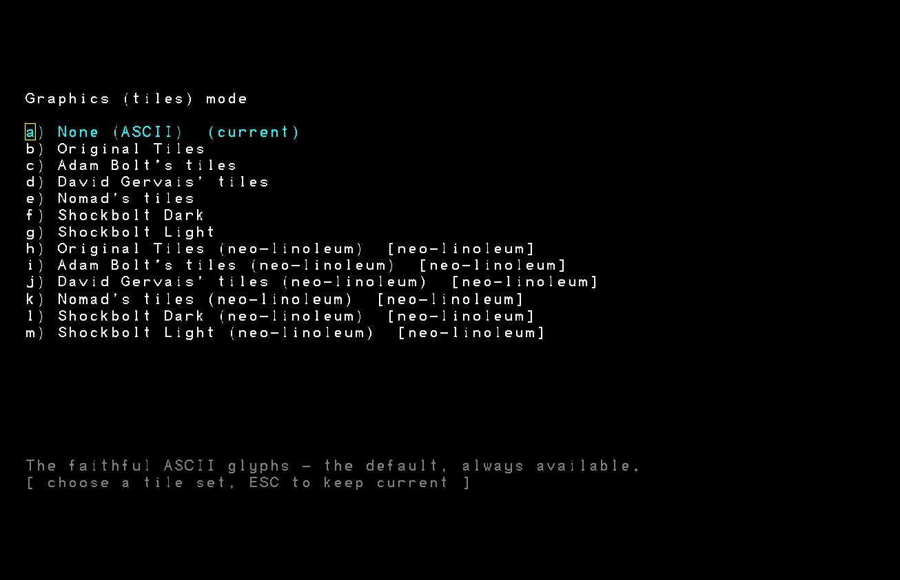

# Linoleum

A second tile engine for [Neo Angband](https://github.com/neostryder/neo-angband),
and the loose-pack tile format it draws.

**This is a mod.** It is not part of the game, it is off until you enable it, and
disabling it leaves the game's own graphics untouched.

## What it is not

Neo Angband already ships the five tile sets Angband itself distributes: Original,
Adam Bolt, David Gervais, Nomad and Shockbolt, the last catalogued as two modes, Dark
and Light. Those are **core content**: all six rows appear in the Graphics screen with
no mod enabled, drawn by the classic tilesheet engine, exactly as upstream. Nothing
here is needed to see them, and nothing here replaces them.

## What it adds

A different way to store a tile set, and an engine that draws it.



Enabling the mod adds six rows to the Graphics screen, one per source tileset, each
tagged `[linoleum]` and drawn by this mod's own engine rather than the classic
one - visible proof that the two engines coexist rather than one replacing the other.

A conventional tileset is one big image plus pixel coordinates: to change the orc you
open a 4096-pixel-wide PNG, find the orc, and edit in place. A **loose pack** is a
directory of individual images addressed by readable names:

```
my-pack/
  manifest.txt              pack id, format, resolution, which maps to read
  maps/
    targets.txt             feat / trap / monster / object / flavour, by name
    families.txt            shared effect metadata (only when authored)
    pools.txt               variant pools (only when authored)
    tall.txt                double-height tiles (only when the set has any)
  images/8/                 one PNG per tile, named for what it draws
    feat_granite_lit_0.png
    monster_cave_orc_0.png
  tile-map.json            parsed source selectors in the JSON tile-map format
```

The `images/` subdirectory is the tile resolution in pixels: `images/8/` for an 8x8
set, `images/32/` for a 32x32 one, and it matches the `resolution:` line in
`manifest.txt`. A target map entry then names an image by base name with no path or
extension:

```
target:feat:GRANITE:asset:feat_granite_lit_0
```

You edit one file at a time, and the map says what it is for in words.

It also does two things a fixed sheet cannot:

- Variant pools. One symbol, creature or item can draw from several tiles instead
  of always the same one. Which tile a given square gets is chosen by map position, so
  it is identical on every replay of a seed: variety without breaking determinism.
- Families. Shared effect metadata across a group of tiles, declared once.
- Double-height tiles, declared by name. A tile listed in `maps/tall.txt` is two
  cells tall and is drawn over the cell above the one it stands in, which is how Shockbolt
  draws its larger monsters. A conventional sheet can only do this by reserving a
  band of rows in the image and telling the game which rows those are; here any tile
  can be tall, in a set with no sheet behind it at all.
- A tile for a creature the pack has never heard of. A mod's own monsters and
  items get a picture under these packs even though no pack was built with them in
  mind, and a picture of their own rather than a duplicate of a relative's. This
  mod supplies that; the game does not. See below.
- A picture for a shapechanged character. A Druid in bear form is drawn as a
  bear rather than as the usual figure, mirrored and repainted in colours picked
  from the character's class and race, with the creature getting more impressive as
  the character levels. Off by default. See below.

## Tiles for modded content

See the [settings reference](SETTINGS.md) for every flag, its default, and when a change takes effect.

**The rule below needs Neo Angband 0.23.0 or newer, and Linoleum 0.15.0 is the version that brought it into this mod.** It used to be the game's own behaviour. The code that draws a modded creature now lives here, and the door it writes through arrived in the game in 0.23.0, which is why the whole mod asks for a newer game than it used to. On an older game, keep Linoleum 0.14.4; the tile sets are the same in both. The floor in `manifest.json` is higher still, at 1.0.0: every first-party mod's floor moves to the game's own version at 1.0.0, on top of the 0.34.0 that the on-demand tilesheet conversion above already needed.

The rule moved because Neo Angband is a faithful port of Angband 4.2.6, and 4.2.6 has no concept of a record added by a mod, so it has no view on what one should look like. Borrowing the nearest relative's picture is a design choice, and the port does not add design choices of its own. It is also a choice about somebody else's art: a tile set drawn in 2003 has no picture for content added twenty years later, and showing a sibling's picture there misleads where a plain letter would not. A tile set making that call for its own art is on firmer ground, so the rule lives here now.

**Under this mod's packs**, a creature or item a mod added, with no tile of its own,
is drawn from its nearest relative with the colour turned: an added monster from a
creature sharing its family, an added item from another item of its type. So a
modded ant is a recognisable ant without its author naming a single pixel
coordinate, and it is not the base game's ant either.

Kin fill is the default for new mod-added content. When a relative's tile would mislead the player, an added item or monster can opt out: set `"linoleum:no-object-kin-fill": true` on its object record or `"linoleum:no-monster-kin-fill": true` on its monster record, and it keeps its plain glyph until it gets a tile of its own. Either field only survives composition when the content mod lists `linoleum` as a dependency or optional dependency.

**Under Angband's own tile sheets, it stays a letter.** Those sheets are one image cut into a fixed grid, and every cell already holds somebody's tile, so there is no spare cell for a variant. The most that could be done is an exact copy of another creature's tile, and that call is not this mod's to make.

In practice:

- Your added creature looks related to its family, and not identical to it.
- Several of them differ from each other too. Colours are handed out per family,
  cycling through eight around the wheel, so the first eight creatures added to one
  family are all distinguishable.
- The same mods always give the same colours. Nothing here touches the game's
  randomness, the clock or your save.
- Nothing you did not add is changed. Only records a mod ADDED are given a tile this way, so an unmodded game draws exactly what it always drew, and a pack with no mods installed produces none of these at all. Kin fill only ever gives a tile to something that has none. The game itself stops it from changing a tile your pack already sets, so turning it on leaves your tile set looking exactly as it did.
- You can still choose the tile yourself. Name an asset for your monster in a target map and that wins outright.
- An added item or monster can opt out of kin fill with `"linoleum:no-object-kin-fill": true` or `"linoleum:no-monster-kin-fill": true` when a relative's tile would be misleading. It then keeps its plain glyph.
- You can turn it off. "Draw modded content from its kin", in this mod's
  options, on by default. Off, modded content keeps its letter.

**If you write mods: draw your own tiles.** This is a fallback for the mods that
do not, not a substitute for drawing an orc. If you ship a mod with no art, say so
in its description and point your players here, so a letter in their dungeon is
something they were told about rather than something that looks broken.

One limit: turning a colour does nothing to a grey tile. If the family's tile is stone, iron or bone, the derived tile comes back the same colour it went in. Stamping a mark onto somebody else's art would get around that, but it would misrepresent the art more than a similar colour does, so the limit stays. Full detail is in [docs/LINOLEUM.md](https://github.com/neostryder/neo-angband/blob/master/docs/LINOLEUM.md) in the main repository.

## A shapechanged character, drawn as the creature

**Off by default.** "Draw a shapechanged character as the creature", in this mod's
options.

Angband 4.2.6 gives the Druid eight shapes, and the map draws none of them: a
character in bear form is still the tile set's usual figure. That is upstream's
own behaviour, and Neo Angband keeps it, because 4.2.6 has no per-shape player
picture and inventing one in the game would be the port adding something. Under
this mod's packs, with this switched on, a shapechange is drawn as the closest
real creature for that form - **mirrored**, and **repainted from a palette picked
from the character's class and race**.

No new art. Every form already has a creature in the game with a tile in these
packs; the two transforms are what stop it reading as "there is a wolf standing
where I was". The mirror is the cheapest possible signal that this is not that
creature: Angband's tiles all face one way, so a mirrored one is visibly the odd
figure on the level. The repaint is a real palette replacement rather than a
colour rotation - every pixel is indexed by brightness into a five-entry ramp and
comes out in the ramp's colours, so it works on a grey wolf and puts the figure in
the character's colours whatever the creature's were. The silhouette is the
creature's exactly, to the pixel: this cannot change what shape the creature is,
only what colours it is drawn in.

### Which creature, at which level

As the character levels, the form moves up to a more impressive member of the same family. Every name below is a real `monster.txt` entry, checked against Angband 4.2.6's monster list and against these packs' target maps, because a plausible name that does not exist draws nothing and looks just like the switch being off.

| Form | Level 1 | then | then | then | then |
| --- | --- | --- | --- | --- | --- |
| fox | wild dog | 25: blink dog | | | |
| Pukel-man | pukelman | 18: Eog golem | 34: colossus | | |
| bear | cave bear | 17: grizzly bear | 33: werebear | 50: Beorn, the Mountain Bear | |
| eagle | blood falcon | 25: giant roc | 50: The Phoenix | | |
| bat | fruit bat | 12: giant tan bat | 23: vampire bat | 34: bat of Gorgoroth | 45: doombat |
| warg | warg | 17: wolf chieftain | 33: hellhound | 50: Huan, Wolfhound of the Valar | |
| vampire | vampire | 12: master vampire | 23: vampire lord | 34: elder vampire | 50: Thuringwethil, the Vampire Messenger |
| werewolf | werewolf | 17: werewolf of Sauron | 33: Draugluin, Sire of All Werewolves | 50: Carcharoth, the Jaws of Thirst | |

When a family's most powerful real member is a unique, that picture is kept for level 50, so a finished character wears it rather than a mid-game one, and the bands below it are spread evenly. A family with no unique at the top spreads all its bands evenly. The levels are chosen by hand rather than taken from each monster's dungeon depth, because depth says where the game places a monster, not how impressive it looks at 32 pixels.

### Three short lists, and why they stay short

Fox has two tiers. Angband 4.2.6 has no fox and no vulpine monster base; `monster_base.txt` offers `canine`, `feline`, `rodent` and `zephyr hound`. The fox shape is small, swift and stealthy, so the small end of the canine base is the closest match, and it stops at `blink dog` because every canine above that is a wolf. The warg and werewolf forms already draw the wolves, and a third form borrowing them would make three shapes look like one. The zephyr hounds are elemental constructs drawn as breath-weapon hounds rather than small canines, so they are left out.

Eagle has three tiers. There is no eagle either, and the bird base has only two non-unique birds of prey, `blood falcon` and `giant roc`, plus `The Phoenix`. The crows (`crow`, `crow of Durthang`, `craban`) are left out, because a low-level eagle drawn as a crow would read as a smaller bird rather than a weaker one. `winged horror` shares the base but is not a raptor.

Pukel-man has three tiers. `pukelman` is the shape's own creature, and above it the progression stays with the stone golems, `Eog golem` and `colossus`, because the shape is stone: it grants ROCK, shard resistance and damage reduction. The deeper golems are metal (mithril, iron and bronze), and `drolem` is a dragon construct, so each of those would be a different kind of creature that happens to share the word.

The other five families are four or five deep with nothing borrowed. Where a
family has more real members than tiers, the extras are named in `plugin.js` with
the reason they were left out.

### The colours

Six palettes by class, one highlight by race, five entries in total.

| Palette | Classes | Reads as |
| --- | --- | --- |
| wild | Druid, Ranger | forest shadow through sunlit leaf |
| holy | Priest, Paladin | warm gold and bone |
| arcane | Mage | cool blue into violet |
| dark | Necromancer, Blackguard | cold desaturated purple over near-black |
| martial | Warrior | iron and steel |
| shadow | Rogue | charcoal into muted teal |

This is a grouping rather than nine palettes, because the palette has one job: say at
a glance whose shape this is. Nine four-colour ramps would be hard for a player to
tell apart, and the classes that read alike do read alike. A Priest and a
Paladin are the same kind of character in the same kind of armour. The Druid and
the Ranger get the earthy one because they are the two classes at home outdoors
and the Druid casts every one of these forms, so it is the palette most players
will ever see.

The **race** supplies the fifth and brightest entry: warm bone for Human, mint and
near-white for the Elf lines, wheat for Hobbit, copper for Dwarf, olive and moss
for the Orc and Troll halves, cyan for Gnome, silver for Dunadan, sulphur for
Kobold. It is the brightest entry deliberately - that band is specular highlight,
the smallest area in any tile, so the class is what reads at a glance and the race
is the accent that separates two characters of the same class. Reversed, every Elf
of every class would look like the same creature. Each highlight is pale rather
than saturated, because a saturated one there reads as a rim light on the figure
rather than as part of it.

Five bands in total is the number most likely to need changing, and it is a
judgement about tiles between 8 and 64 pixels wide with the 8-pixel end weighted:
fewer reads flatter and more stylised, more preserves the creature's own shading.
The engine takes up to sixteen.

### Where it falls back, and to what

Every one of these leaves the tile set's own player picture exactly as it is,
which is what an unmodded game draws:

- The switch is off, which is the default.
- The character is not shapechanged, which is almost all of the time.
- The tile set is one of Angband's own sheets rather than a linoleum pack. A
  fixed sheet is one image cut into a grid with no spare cell to put a variant in,
  so there is nothing to allocate.
- The game has no player-tile seam. This needs a door the game first shipped
  in 0.27.0. On an older game the switch does nothing, everything else in this
  mod works unchanged, and the log says so once.
- The class or race has no palette in this mod, which means one a content mod
  added. Guessing that a modded class is "martial" would put a colour on somebody
  else's character with nothing behind the choice, so it declines instead.

And one that falls back to a lower tier rather than to nothing: **a pack that does
not draw that band's creature**. Measured, this is two monsters. `werewolf of
Sauron` and `Beorn, the Mountain Bear` were added to Angband in 4.2.x and only
ever added to Shockbolt's own pref file upstream, so under Original Tiles, Adam
Bolt and Nomad neither has a tile, and under Gervais the bear has none. A level 17
werewolf under those packs is a plain werewolf until level 33, and a level 50 bear
is a werebear. The shipped packs are checked against this list on every push, so a
band that quietly loses its art is a red build rather than a silent downgrade.

## Building a pack

The converter turns a conventional tileset into a loose pack. It lives in the main
repository and is **not published to a package registry**. It is a workspace tool,
so you run it from a clone rather than fetching it:

```bash
git clone https://github.com/neostryder/neo-angband.git
```

```bash
cd neo-angband && pnpm install && pnpm build
```

```bash
node packages/linoleum/dist/cli.js --packs original-tiles --out ./my-packs
```

`--tiles <dir>` is the tiles root to read (default `reference/lib/tiles`, the Angband
4.2.6 tree that ships in that repo), `--out <dir>` is where packs are written, and
`--packs <keys>` picks which to convert. `--help` lists the keys. It converts the six
tilesets Angband itself ships: `original-tiles`, `adam-bolt`, `gervais`, `nomad`,
`shockbolt-dark`, `shockbolt-light`, driven by each one's `graf`/`xtra`/`flvr` pref
files. To convert a tileset from somewhere else you add its geometry and pref-file
names to `ALL_PACKS` in `packages/linoleum/src/packs.ts`; there is no
arbitrary-tileset mode on the command line. And nothing stops you writing a pack by
hand, since the format is text plus PNGs, and the converter is a convenience, not a
gatekeeper.

Then point a `tilePacks` entry at the result:

```json
"tilePacks": [
  { "grafID": 101, "engine": "linoleum", "menuname": "My Set", "path": "my-set" }
]
```

**`path` is relative to the mod folder**, not to the site. A mod cannot know where a
host serves it from, and for two of the three ways a mod arrives the host serves it
from nowhere at all: a folder you picked in a browser has no URL for its files until
their bytes are wrapped in a `blob:`, and a mod installed from a repository lives in
IndexedDB. The game composes your `path` with however that mod's bytes are reached, so
a pack works identically whichever way it got there. Use `grafID` >= 100 for a set of
your own; 1 to 6 are Angband's own numbering, and claiming one of those re-skins that row.

See
[docs/LINOLEUM.md](https://github.com/neostryder/neo-angband/blob/master/docs/LINOLEUM.md)
in the main repository for the format in full.

**Packs you build are yours, and the art in them is not mine to license.** If you
convert a tileset the result carries whatever licence the original art carried:
converting does not change who owns it, and **a conversion is a modification**: it
cuts one sheet into hundreds of separate images, so a licence that permits
redistribution but not modification does not permit a converted pack at all.
Angband's own licence for the Shockbolt set is exactly that case; Neo Angband
converts and bundles it under permission its author granted that project
specifically, which does not travel to a pack you extract from a build. Convert your
own copies freely for your own use; check the licence before you share one.
[CREDITS.md](CREDITS.md) is this mod's attribution, and it is where those per-set
terms are spelled out.

## Installing

**The source sheets ship here; loose files are made on demand.** `dist/` holds one
compact source archive per distinct atlas, plus a small root archive for the
manifest, this README, the licence and [CREDITS.md](CREDITS.md). The game converts a
sheet the first time its Graphics row is selected and keeps those generated loose files
in its local IndexedDB cache. Switching to that row again reuses the cache.

| Archive | Files | Size |
| --- | --- | --- |
| `neo-linoleum-mod.zip` | 5 | 0.03 MiB |
| `neo-linoleum-original-tiles.zip` | 2 | 0.16 MiB |
| `neo-linoleum-adam-bolt.zip` | 2 | 0.46 MiB |
| `neo-linoleum-gervais.zip` | 2 | 1.25 MiB |
| `neo-linoleum-nomad.zip` | 2 | 0.05 MiB |
| `neo-linoleum-shockbolt.zip` | 3 | 16.75 MiB |

That is 16 archive entries and 18.7 MiB in total. Shockbolt Dark and Light use the same atlas, so they share one three-file source archive with a tile map for each mode; two copies of the atlas would make the compact form larger than the old loose-pack payload. The game's installer fetches each archive from a pinned tag, records the SHA-256 of the bytes that arrived, and unpacks them into the mod's own folder. The cache holds only derived files, and reinstalling or updating the mod starts a fresh conversion namespace. Nothing about these packs lives in the game's repository.

You can also just use the folder: clone this repository into your mods directory, or
point the browser build at it with **Load mod folder**. Unzip the source archives beside
`manifest.json`, or rebuild them from source art with `node tools/build-packs.mjs`
(needs a built Neo Angband checkout at `../neo-angband`) followed by
`node tools/pack.mjs`.

<details>
<summary>Why six archives rather than 9149 committed loose files, or one big zip</summary>

A loose pack is one PNG per tile, but the shipped input is an atlas plus a JSON tile map. An `archive` payload is one HTTP request and one digest; the alternative, a `files` payload, would be a request per input file and makes partial installs harder to diagnose.

One archive per source atlas, rather than a single archive for everything, means a failed digest names the source that failed, and a fix rewrites only that archive. Shockbolt's one atlas serves two rows, so it gets one archive rather than a duplicated pair.

The mod's five root files get an archive of their own. An installed mod's file list is whatever its archives contained, and the game's shared validator expects a top-level `manifest.json` from every source, so the root files have to be in some archive. Putting them in all six would make them collide, because the installer rejects a path that arrives from two archives instead of silently keeping the last one. `tools/pack.mjs --verify` fails if any committed archive has drifted from freshly staged source art, and CI runs it on every push.

This README is shipped content. `manifest.json`, `plugin.js`, `README.md`, `LICENSE.md` and `CREDITS.md` are the five files inside `neo-linoleum-mod.zip`, so editing any of them, even to fix a typo or a link, changes that archive's digest and leaves the committed copy stale. Re-run `node tools/pack.mjs` in the same commit, because a documentation-only change here is still a build.

The zips are written deterministically (sorted entries, fixed timestamps, stdlib `zlib` only), so the digest depends only on content and a rebuild anywhere gives the same bytes. Two builds into different directories produced seven identical files.

</details>

## Status

**0.17.0: complete and working, but not yet 1.0.** 0.15.0 was the first version to carry code: one `plugin.js` holding the kin rule that moved out of the game, with its own tests in this repository. 0.16.0 added the shapechange rule to the same file.

The shapechange rule has been seen rendering in the game. Its tier tables and palettes are checked value by value, its monster names against Angband's own monster list and its tiles against the shipped packs' target maps, and the whole path from the switch to an allocated tile is driven through the game's real door over real art. In a live game, a level 2 Human Druid under Adam Bolt's tiles cast Fox Form, and the tile on the player's square changed from the normal figure to a mirrored, repainted quadruped that followed the player through a move. That covers one form and one class palette under one pack. The wider survey of two forms and two palettes, and the aesthetic calls it needs, is still open; see [PLANNED.md](PLANNED.md).

The engine, the format, the converter and all six packs are built and in use, and the chain has been checked end to end. Each of the converter's 1499 output PNGs is pixel-identical to the cell of the source tilesheet that Angband's own `graf-*.prf` says it came from. Enabling this mod adds its six Graphics rows, and disabling it removes them and nothing else, leaving the game's own six untouched. Choosing one of the rows draws the map through the loose-pack engine: on the same view it draws the same 1110 tiled cells as the tilesheet engine and matches about 96% of map pixels, with the rest on cell seams where the two engines round an 8-pixel source to a fractional destination height differently. `packages/web/src/linoleum-equivalence.test.ts` in the main repository runs the first of those checks automatically for five bundled packs, Shockbolt included, and that is how a comparator that cropped 64x64 out of a double-height 64x128 tile was found.

No known defect is holding back 1.0. The format has been used by one author against five tilesets, and a 1.0 version promises a stability that a pack format should not claim until someone else has built a pack with it. If you build one and the format gets in your way, that feedback is what moves this to 1.0. Until then, treat `manifest.txt` and the map syntax as stable in practice but not frozen.

Third-party tile sets raise a licensing question for each set, since converting a sheet into a loose pack modifies the art and not every tileset licence permits that. Convert your own copies freely, and check the licence before you share one.

## Working on this repo

This repository is public, and so is the main one. A privacy scan refuses a handful
of strings in either. See `CONTRIBUTING.md` in
[neo-angband](https://github.com/neostryder/neo-angband). The scanner lives there and
is used from there rather than copied here, so there is nothing to install; point this
clone's hooks at it once:

```sh
git config core.hooksPath /path/to/neo-angband/.githooks
```

That hook is the check that sees a new file before it is committed. The `privacy` workflow runs later and reads tracked files, so by the time it can see a new file the bytes are already published. Use both.

Since 0.15.0 there is code here as well, so there is one command to run before
pushing:

```sh
pnpm install --frozen-lockfile && pnpm verify
```

That runs the plugin's tests and then checks the committed archives under `dist/`
against a fresh build, which is what catches a manifest or a plugin edited without
the archive being rebuilt - an installed mod's files are whatever its archives held,
so a stale archive is a player running last week's code with nothing to say so.

One of those tests, `joint.node.test.mjs`, drives this mod's real `plugin.js`
through the GAME's real fill door over real tile art, which is the only place both
halves of the seam exist at once. It needs a built checkout of
[neo-angband](https://github.com/neostryder/neo-angband) beside this one (`../neo-angband`,
the same layout CI uses) and **fails** without it rather than skipping quietly. If
you have only this repository:

```sh
JOINT_OPTIONAL=1 pnpm test
```

## Releasing

A tag matching `vX.Y.Z` is the release: there is no separate publish step. Every
tag, patch included, posts an announcement to the RPGM Tools Discord's Neo
Angband announcements forum automatically, built from the matching
[CHANGELOG.md](CHANGELOG.md) heading.

## Questions, or something wrong

[**The RPGM Tools Discord**](https://discord.gg/YegtwbHTBQ) is the fastest way
to ask anything - whether a behaviour is intended, how to get this installed,
or what you should try next. No GitHub account needed.

[Open an issue here](../../issues/new/choose) for a bug in **this mod**. Two
things belong against the game instead, and the forms will point you there: the
mod **system** (an install that fails, a load order that will not stick, a
conflict report that looks wrong), and the game **not matching Angband 4.2.6**
once this mod is switched off - changing the game is what a mod is for.

For anything that should not be public, including a security report:
**strider-angband (at) rpgm.tools**. See
[SECURITY.md](https://github.com/neostryder/neo-angband/blob/master/SECURITY.md).

Asking about AI use in this project? [AI_USAGE_POLICY.md](AI_USAGE_POLICY.md) is
the complete answer.

[TERMS.md](TERMS.md) covers use of this mod. The core repository's
[PRIVACY.md](https://github.com/neostryder/neo-angband/blob/master/PRIVACY.md)
covers what is stored and what network requests the game makes. Project
participation is subject to the shared [CODE_OF_CONDUCT.md](CODE_OF_CONDUCT.md).

## Licence

Same dual licence as Neo Angband and Angband: GPL v2 or the Angband licence. See
[LICENSE.md](LICENSE.md).

The **art** in any pack is a separate matter from the code here, and is governed by
whatever licence that art carries.

## Credits

Built by neostryder / RPGM Tools as part of Neo Angband. Angband is the work of Ben
Harrison, James E. Wilson, Robert A. Koeneke and the Angband contributors.
